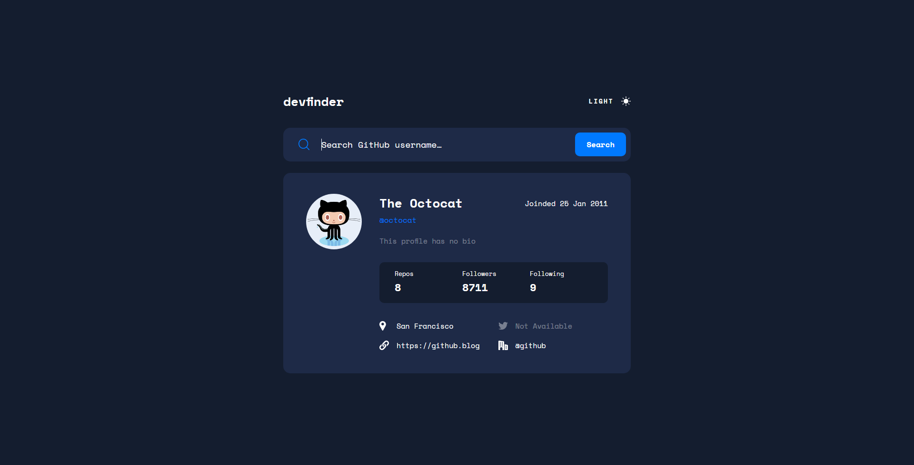

# GitHub user search app

This is a solution to the [GitHub user search app challenge on Frontend Mentor](https://www.frontendmentor.io/challenges/github-user-search-app-Q09YOgaH6).

## Table of contents

  - [The challenge](#the-challenge)
  - [Screenshot](#screenshot)
  - [Links](#links)
  - [Built with](#built-with)
  - [Author](#author)

### The challenge

Users should be able to:

- View the optimal layout for the app depending on their device's screen size
- See hover states for all interactive elements on the page
- Search for GitHub users by their username
- See relevant user information based on their search
- Switch between light and dark themes
- **Bonus**: Have the correct color scheme chosen for them based on their computer preferences. _Hint_: Research `prefers-color-scheme` in CSS.

### Screenshot

### Links

- [Live Site](https://hromus-51.github.io/github-user-search-app/)

### Built with

- HTML5 
- [SASS/SCSS](https://sass-lang.com/)
- [clsx](https://www.npmjs.com/package/clsx)
- [react-responsive](https://www.npmjs.com/package/react-responsive)
- [Framer Motion](https://www.framer.com/motion/)
- [Theme UI](https://theme-ui.com/)
- [Redux Toolkit](https://redux-toolkit.js.org/)
- [Redux Persist](https://www.npmjs.com/package/redux-persist)
- [TS](https://www.typescriptlang.org/)
- [React](https://reactjs.org/) 

## Author

- Telegram - [Ilgiz Farrakhov](https://t.me/Gizmo51)

